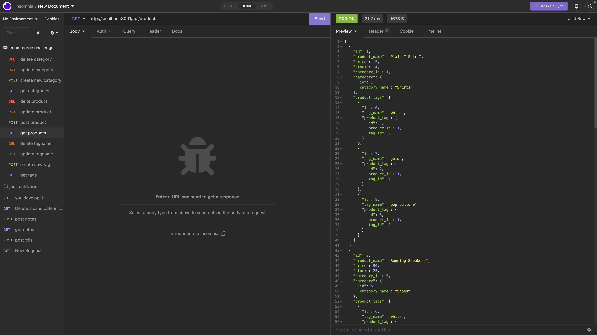

# E-commerce-Back-End

## Purpose
This is the back end routes for a ecommerce company that keeps track of its products using products tags and categories.

## Built With
* Javascript
* Node.js
* Sequelize.js
* mysql2

## GitHub Repository
https://github.com/Itzamary/E-commerce-Back-End

## Google Drive Video
https://drive.google.com/file/d/1jAxSDtxbjRk8mT83FRcLEnZvHagVdniI/view

## Website Image
